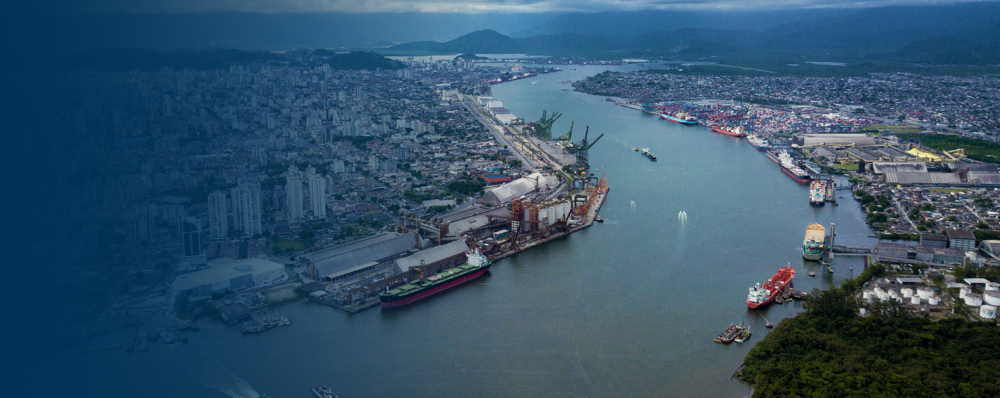

# Harbor Project

The Port of Santos is the main Brazilian Port, located in the city of Santos, São Paulo, It's the biggest port complex not only in Brazil but in whole Latin America and one of the biggest in the world, with an area greater than 7.5 millions m². The Port influences primarily 75 million people, 67% of Brazil's GDP and 57% of Brazil Trade Balance.

With such big numbers, it's quite natural for the Port to be a big source of operational data every day, and on it's official website, it's not hard to find a couple of them about the actual docked ships, schedule dockings and operations, and also some rather complex dashboards with historical data. 

## Goals

The idea of this project is to simply build a data pipeline to consume the publicly available data on it's website and generate some complementary views about the port's operations along the days.

Along with that, this project also has the technical and personal goal of training on developing data solutions on the Google Cloud Platform (commonly referenced as GCP), which were a subject of my studies at the time this project was done. 

## Data Pipeline

The Data Pipeline of this project was intetionally created in a very simple way, both because the size of data batches ingested are quite small, and also for a personal selection of tools I wanted to practice on this project.

It's main structure is based on the following elements:
- A simple Datalake, implemented using the Google Cloud Storage;
- A Data Pipeline, built with Python code using the Pandas Framework as the main processing engine, and implemented on Cloud using the Google Cloud Fuctions for it's execution and the Google Cloud Scheduler for triggering it's execution on scheduled intervals;
- A Data Warehouse, implemented on Google Big Query;
- Dashboard for visualizing the processed data, implemented on Looker Studio.

Let's understand the whole process in more details.

> 1. The pipeline follows a ELT principle of design. So the first step of the process is extract the data. The specific data used on this project was available in two of the websites pages as HTML tables. So, a scraping process was implemented using Beautiful Soup, and the resulting data, without any processing was saved in the raw layer of the Datalake.
> 2. After the extraction, the next step involves the processing of the data. As said before Pandas was used as the main processing engine, and the generated data was saved on the Datalake's trusted layer. The operations involved on this step were basically cleaning operations, with practically no big alterations on the data schema.
> 3. With the trusted data generated, the results are then transfered to the Data Warehouse using the scheduled Data Transfer service offered by Big Query itself. 
> 4. On Big Query, some specific analytical views are created using SQL code, which involved some joins operations and filtering, and then are used by Looker Studio for the visualizations.

In terms of scheduling, this whole process only involve three schedulable steps:
- The execution of the pipeline on Cloud Functions, which is triggered by Cloud Scheduler on every hour at minute 00.
- The transfer from the Datalake to the Data Warehouse, which was scheduled to run hourly at minute 10, giving enough time to the pipeline be executed and then handling updated data to the Warehouse.
- The update of the Data Source on Looker Studio, which was scheduled to run hourly. Specifying the minute to run was unfortunately not supported.

## Visualizations

For the visualizations, at the first moment, I decided to focus only on showing the most recent data about the Docked Ships, as a way to present a snapshot of the actual status of the Port. This information is presented on the website, but just in a tabular format, and I wanted to enhance that with more interesting visualizations.

The visualizations made on the dashboard are made based on a view created on Big Query. This view, in turn, is generated from two processed tables originated directly from the source:
- The First One, that I called 'docked-ships' is a table listing the actual docked ships on the Port, the kind of load they are carring and the amount to load and unload.
- The second table, that I called 'operations', contained more specific data about the operations done on the Port of loading and unloading. Fields related to Agents, Operators, Docking Time and Timestamps of the Start of Operation and Expected Ending, for example, are available on this table.

So, as said, to get the benefits of both tables, a view is created on Big Query by the following main steps:
> 1. Join together relevant informations of both tables;
> 2. Since a docked ship can have more than one operation associated with, the data is grouped by ship and extract time, so the resulting dataset has only one row per ship per extract time;
> 3. Filter data to only the most recent extract time, as a way to show only the most recent snapshot of the docked ships.

The results of these steps are then forwarded to Looker Studio for visualizations, which can be found [here](https://lookerstudio.google.com/reporting/965d7008-9553-4228-b5b3-9392384a8562).

## Some Decisions

I created this section just to address some decisions I made on this project, being questionable on not (and also to remember myself in the future why I did some stuff).

First one is that, as show in the GCP Architecture Diagram, there's only one Cloud Function implemented to handle all the data pipeline. Another possibility would be to have two functions: One to extract the data and load the raw layer, and another one ingesting the raw data, processing it and then loading the trusted layer. I prefered the Single Function model basically for two reasons: It's more easy to manage, and by concentrating all the code on one fuction, I could train my data organization when building a pipeline using the best practices, which was a downside of my previous projects.

Second decision, is that despite keeping all my code and repository written in English, I decided to keep the Dashboard presented with Brazilian Portuguese. That basically happened because the data have some categorical fields with a lot of different values all written on Portuguese, and not only it would be dauting to translate everything, but also I wouldn't be able to handle future cases of new categories if they happen. So, I decided to keep everything on the dashboard in the same language, but keep all on the repository as English, since it's almost a pattern for my other projects.

Third, is about the hourly updates. Could it be reasonable to do updates on higher frequencies? Yes, the data on the website appears to be updated in a interval of some minutes. But despite that I decided to keep things on the basis of hours, again for two reasons. First, and most important, I would not like to cause any load excess on the source website doing scraping, so I decided to keep a balance between low access and reasonable update frequency for the project. And second, keeping a lower number of calls to Cloud Functions avoid me to burst the bank on GCP.

## Further Steps

- Internally, the Cloud Functions basically creates a container with the uploaded code, and execute it on the Google Cloud Run, which is Google's serveless Kubernetes service. So, a further step on this project could be to jump this intermediary step and deploy the data pipeline directly on Google Cloud Run by creating a Docker Image for it. Not only it may be a more robust decision, but also Cloud Run seen more easily integrated with CI/CD tools like GitHub Actions, which would facilitate future updates and fixes on the code.
- GCP have a more specific product for data pipelines, the Dataproc. Technically, the Dataproc is a serveless Apache Beam service, with more robust tools for this kind of job like DAG creation, monitoring and scheduling, which would make a more robust element for running the data processing of this project.
- At first, the visualizations were focused mainly on showing data related to the actual state of the Docked Ships only. However, as more data is being stored on the Datalake, in a certain moment all the historical data should have a great potential to be explored.

## References

https://www.embrapa.br/macrologistica/exportacao/porto_santos

